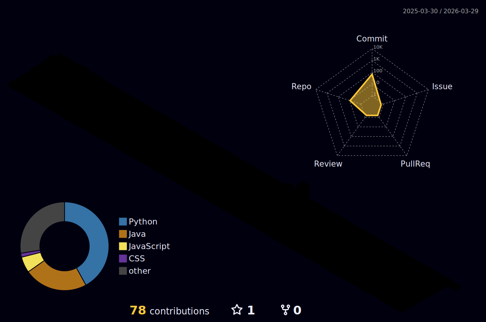

  <h1 align="center">Hi, I’m <b>Raj Kundur</b> 👋</h1>
  

    Master’s student in Computer Science at <b>California State University, Long Beach</b> 
    Software Developer • Data and AI Enthusiast
  

  <!-- Socials -->
  

    
    
    
  

---

### 💡 About me
- CSULB MSCS student focused on building reliable software and exploring applied AI
- Interested in backend systems, data engineering, and ML infrastructure
- Always learning, shipping, and collaborating

---

### 💻 Tech Stack
<!-- badges kept from your original -->

---

### 📊 GitHub Stats

  
   
  
   
  

---

### 🏆 GitHub Trophies

  

---

### 🔝 Top Contributed Repos

  

---

### 🗻 3D Contribution Landscape
After the workflow runs, the generated SVG will appear here. If the filename differs, update the path.

  

---

  

<!-- Proudly created with GPRM ( https://gprm.itsvg.in ) -->
