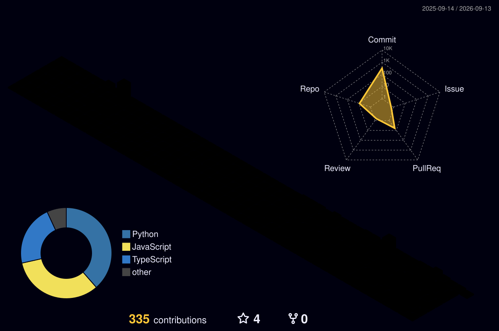

# Hi, I'm **Raj Kundur** 👋

### Software Engineer • Full-Stack Developer • AI/ML Enthusiast

Master's student in Computer Science at **California State University, Long Beach**

  
  
  
  

---

## 💡 About Me

- 🎓 MS in Computer Science at **California State University, Long Beach**
- 💻 Building full-stack applications, backend systems, and AI-powered products
- 🤖 Exploring **AI agents, LLM applications, RAG, NLP, and intelligent automation**
- ⚙️ Interested in **software engineering, distributed systems, AI/ML, and cloud technologies**
- 🚀 Always learning, building, and shipping real-world projects
- 🌐 Explore my work: [Portfolio](https://portfolio-eosin-mu-63.vercel.app/)
---

## 💻 Tech Stack

### Languages

### Frontend & Mobile

### Backend & APIs

### AI / ML

### Data, OCR & Search

### Databases

### Cloud, DevOps & Developer Tools

### Design

---

---

## 🚀 Featured Projects

### 🧠 Vitalex
AI-powered healthcare policy intelligence platform for summarization, comparison, impact analysis, and rule generation.

**Tech:** Next.js • React • TypeScript • Tailwind CSS • Supabase • Google Gemini

[View Repository](https://github.com/RajK158/VitaLex) • [Live Demo](https://vitalex.vercel.app)

---

### 💼 Impulso
Chrome extension and FastAPI backend for job application assistance, including profile caching, job scraping, autofill, and AI-powered resume tailoring.

**Tech:** JavaScript • Python • FastAPI • Chrome Extensions • Gemini API • Docker

[View Repository](https://github.com/RajK158/BrandFit-Resume)

---

### 🩺 Pharma Copilot
AI-powered diagnostic assistant that analyzes medical reports using specialist agents and retrieves similar cases with semantic search.

**Tech:** React • FastAPI • SQLAlchemy • FAISS • Hugging Face • Tailwind CSS

[View Repository](https://github.com/RajK158/pharma-copilot-ai)

---

### 🧾 Multi-Language Invoice Extractor
AI-powered system for extracting structured data from multilingual invoices using OCR, NLP, validation, and full-text search.

**Tech:** Python • FastAPI • Streamlit • spaCy • Tesseract OCR • EasyOCR • SQLite

[View Repository](https://github.com/RajK158/Invoice-Extractor)

---

### 🍽️ Intelligent Bistro
AI-powered restaurant ordering app with a conversational assistant that converts natural language into structured cart actions.

**Tech:** React Native • Expo • TypeScript • Node.js • Express • OpenAI API

[View Repository](https://github.com/RajK158/Intelligent-Bistro)
---

## 🗻 3D Contribution Landscape

  

---

  

